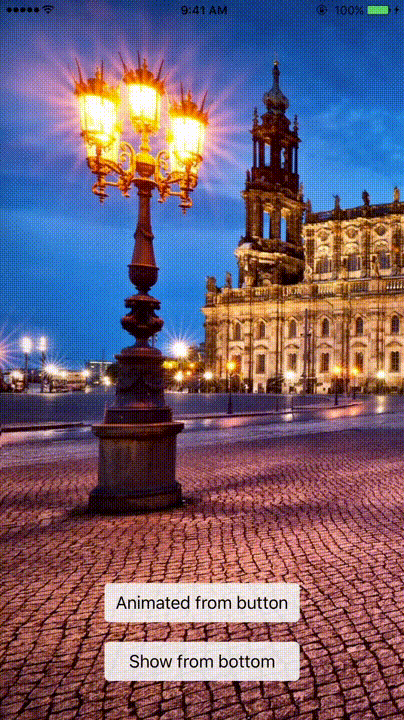

# NKModalPresenter
`NKModalPresenter` allows you to present modal view controller easily and beautifully with animation.



## Installation

NKModalPresenter is available through [CocoaPods](http://cocoapods.org). To install
it, simply add the following line to your Podfile:

```ruby
pod 'NKModalPresenter'
```


## Usage
```swift
import NKModalPresenter

let viewController = MyViewController()

// Presenting
viewController.presentAsModal()
viewController.presentAsModal(animate: .from(view)) // transition from view
viewController.presentAsModal(animate: .fromTop, to: .center) // customize the animation path

// Dismissing
viewController.dismissModal(animated: true, completion: nil)
```

## Examples

Example project provided in Example folder.

## Requirements

* iOS 9+
* Swift 4.2+
